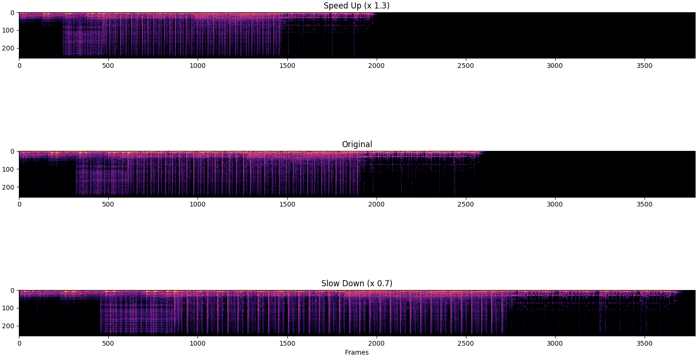
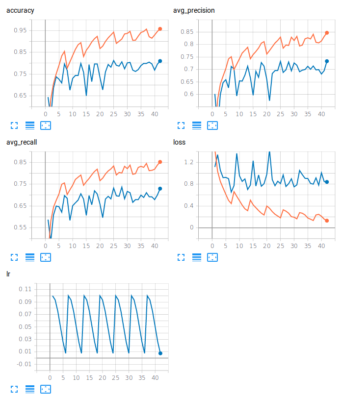

# 수정중입니다.

[ksanjeevan](https://github.com/ksanjeevan/crnn-audio-classification)을 참고하여 코드를 작성했습니다.

## Usage

### Inference
Run inference on an audio file:

```bash
./run.py /path/to/audio/file.wav -r path/to/saved/model.pth 
```
<p align="left">

</p>


### Training
```bash
./run.py train -c config.json --cfg arch.cfg
```

#### Augmentation
Dataset transforms:

```bash
Compose(
    ProcessChannels(mode=avg)
    AdditiveNoise(prob=0.3, sig=0.001, dist_type=normal)
    RandomCropLength(prob=0.4, sig=0.25, dist_type=half)
    ToTensorAudio()
)
```
As well as [time stretching](https://github.com/keunwoochoi/torchaudio-contrib/blob/781fe10ee0ee6ccab4628c7e0a56ce8e3add0502/torchaudio_contrib/layers.py#L236):

<p align="left">

</p>


##### TensorboardX
<p align="left">

</p>

#### Evaluation


```bash
./run.py eval -r /path/to/saved/model.pth
```

Then obtain defined metrics:
```bash
100%|█████████████████████████████████████████████████████████████████████████████████████████████████| 34/34 [00:03<00:00, 12.68it/s]
{'avg_precision': '0.725', 'avg_recall': '0.719', 'accuracy': '0.804'}
```

##### 10-Fold Cross Validation

| Arch   |      Accuracy      |  AvgPrecision(macro) | AvgRecall(macro) |
|----------|:-------------:|------:|------:|
| CNN |  71.0% | 63.4% | 63.5% |
| CRNN |  72.3% | 64.3% | 65.0% |
| CRNN(Bidirectional, Dropout) |  73.5% | 65.5% | 65.8% |
| CRNN(Dropout) |  73.0% | 65.5% | 65.7% |
| CRNN(Bidirectional) |  72.8% | 64.3% | 65.2% |

Per fold metrics CRNN(Bidirectional, Dropout):

| Fold   |      Accuracy      |  AvgPrecision(macro) | AvgRecall(macro) |
|----------|:-------------:|------:|------:|
|1|73.1%|65.1%|66.1%|
|2|80.7%|69.2%|68.9%|
|3|62.8%|57.3%|57.5%|
|4|73.6%|65.2%|64.9%|
|5|78.4%|70.3%|71.5%|
|6|73.5%|65.5%|65.9%|
|7|74.6%|67.0%|66.6%|
|8|66.7%|62.3%|61.7%|
|9|71.7%|60.7%|62.7%|
|10|79.9%|72.2%|71.8%|


### To Do
- [ ] commit jupyter notebook dataset exploration
- [x] Switch overt to using pytorch/audio
- [x] use torchaudio-contrib for STFT transforms
- [x] CRNN entirely defined in .cfg
- [x] Some bug in 'infer'
- [x] Run 10-fold Cross Validation
- [x] Switch over to pytorch/audio since the merge 
- [ ] Comment things


