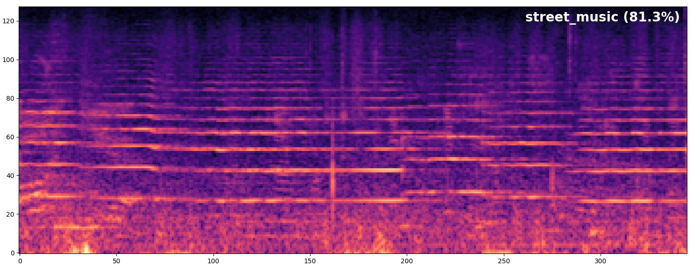

# 수정중입니다.

[ksanjeevan](https://github.com/ksanjeevan/crnn-audio-classification)을 참고하여 코드를 작성했습니다.


### Inference
Run inference on an audio file:

```bash
./run.py /path/to/audio/file.wav -r path/to/saved/model.pth 
```
<p align="left">

</p>


### Training
```bash
./run.py train -c config.json --cfg arch.cfg
```

#### Augmentation
Dataset transforms:

```bash
Compose(
    ProcessChannels(mode=avg)
    AdditiveNoise(prob=0.3, sig=0.001, dist_type=normal)
    RandomCropLength(prob=0.4, sig=0.25, dist_type=half)
    ToTensorAudio()
)
```
As well as [time stretching](https://github.com/keunwoochoi/torchaudio-contrib/blob/781fe10ee0ee6ccab4628c7e0a56ce8e3add0502/torchaudio_contrib/layers.py#L236):

<p align="left">

</p>


##### TensorboardX
<p align="left">

</p>

#### Evaluation


```bash
./run.py eval -r /path/to/saved/model.pth
```

Then obtain defined metrics:
```bash
100%|█████████████████████████████████████████████████████████████████████████████████████████████████| 34/34 [00:03<00:00, 12.68it/s]
{'avg_precision': '0.725', 'avg_recall': '0.719', 'accuracy': '0.804'}
```
